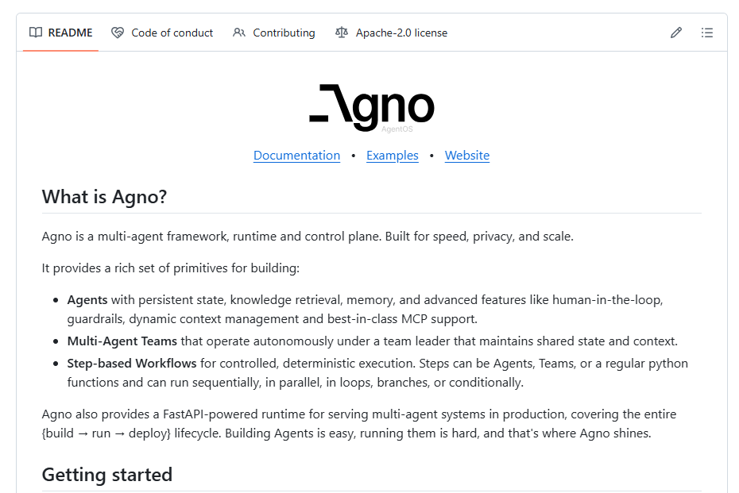

# 🤖 Projeto de Agente de Inteligência Artificial com Framework Agno

**Trabalho de Conclusão da Disciplina de Aprendizado de Máquina — Pós-Graduação em Inteligência Artificial Aplicada (IFTO)**  
**Autor:** Carlos Jorge Sarmento Neto  
**Instituição:** *Instituto Federal do Tocantins (IFTO)*  
**Disciplina:** *Aprendizado de Máquina*  
**Ano:** 2025

---

## 📘 Descrição do Projeto

Este projeto foi desenvolvido como parte da disciplina de **Aprendizado de Máquina** na pós-graduação do **Instituto Federal do Tocantins (IFTO)**.  
O objetivo foi construir um **agente de IA conversacional inteligente**, capaz de interagir com o usuário em linguagem natural e executar ações com base em prompts enviados via API REST.

A arquitetura é baseada no **framework [Agno](https://github.com/agno-ai/agno)** — uma plataforma moderna para construção de agentes autônomos e multiagentes que utilizam modelos de linguagem (LLMs).

---

## 🧠 Conceito do Modelo

O modelo central é um **LLM (Large Language Model)** — um modelo de linguagem natural treinado em grande escala.  
Ele **não utiliza um modelo de decisão tradicional** (como árvore de decisão, regressão logística, ou SVM).  
Em vez disso, o raciocínio é baseado em **inferência contextual** e **prompt engineering**.

### Tipo de Agente

- **Agente Multiagente (Multi-Agent Architecture)**: o framework Agno permite a criação de múltiplos agentes com papéis específicos (por exemplo: agente de análise, agente de recomendação, agente de suporte, etc.).
- **Agente Reativo**: responde a estímulos (mensagens) do usuário em tempo real.
- **Baseado em LLM (GPT da OpenAI)**: utiliza o modelo `gpt-3.5-turbo` ou superior, via API OpenAI.

---

  

---

## ⚙️ Tecnologias Utilizadas

| Tecnologia | Descrição |
|-------------|------------|
| **Python 3.10+** | Linguagem principal do projeto |
| **FastAPI** | Framework web moderno e performático para criação da API REST |
| **Uvicorn** | Servidor ASGI para executar a aplicação |
| **Agno** | Framework para criação e orquestração de agentes de IA multiagentes |
| **OpenAI API** | Provedor do modelo de linguagem GPT |
| **Pydantic** | Validação de dados no FastAPI |
| **PowerShell / cURL** | Ferramentas para enviar requisições de teste à API |

---

## 🖥️ Utilizando o Agente 

**1º - pip install -r requirements.txt** - Instalar Depêndencias  
**2º - Crie sua chave de API da OPENAI** - Salve a sua chave de API em um arquivo .env (Variável de Ambiente)

## Testando Localmente:

iniciar um server localmente uvicorn:

uvicorn server:app --reload

saída que está ativo:
INFO:     Uvicorn running on http://127.0.0.1:8000 (Press CTRL+C to quit)

abrir no navegador:
http://127.0.0.1:8000/

Documentação FastAPI:
http://127.0.0.1:8000/docs

para testar no terminal digite:

curl -X POST http://127.0.0.1:8000/chat -H "Content-Type: application/json" -d '{"message": "Oi, quero ver produtos"}'

fazer teste automático:

pytest -v

## Teste Online, faça deploy em seu back-end e integrações com chave de API
